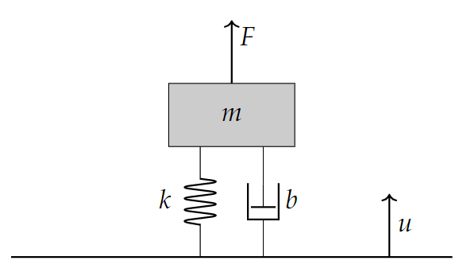

# Introduction
Main functions that are used by the various QZS models

## ampratiomeasure.m
Get the amplitude ratio of two time-domain signals x and 

### Function: 
* AmpRat = ampratiomeasure(x, y)

### Parameters:

| Parameter     | Explanation               | Units
| ------------- | :-------------:           |:-------------:|
| x             |First Time Domain Signal   | Vector of a signal|
| y             |Second Time Domain Signal  | Vector of a signal|

### Output:
| Parameter     | Explanation               | Units
| ------------- | :-------------:           |:-------------:|
| Amp           | Ratio of signal amplitudes| [None]|

## designedSystem.m
State-space implementation of a single degree of freedom Mass/Damper/Spring system. Implements non-linear stiffness within the model by recalculating the stiffness each time the function is called. Obtains an input signal from the "inputFn.m" file. The input is ground excitation. 

### Function: 
* dydt = designedSystem(t,q,freq,multiplier,m,c, h_0, L_0, L_min, K_h)

### Parameters:

| Parameter     | Explanation               | Units
| ------------- | :-------------:           |:-------------:|
| t             |Time                       | Seconds       |
| q             |State of the system        | [None]        |
| freq          |Signal Frequency           | Hz            |
| multiplier    |Amplitude of the sinusoid  | [None]        |
| m             |Mass of the system         | kg            |
| c             |System damping coefficient | Ns/m          |
|h_0            |Height of the horizontal springs under no-load         |Meter|
|L_0            |Full Length of the springs under no-load               |Meter|
|L_min          |Minimum Length of the springs (springs horizontal)     |Meter|
|K_h            |Horizontal Spring Stiffness (spring providing the negative stiffness in the vertical direction| Newtons/Meter|

### Output:
| Parameter     | Explanation               | Units
| ------------- | :-------------:           |:-------------:|
| Amp           | Ratio of signal amplitudes| [None]|

## get_k_nonLinear.m
Use the system parameters for the Quasi-Zero Stiffness System to determine the stiffness at a given state of the system. 

### Function: 
* k_nonLinear = get_k_nonLinear(x_in, h_0, L_0, L_min, K_h)

### Parameters:

| Parameter     | Explanation | Units
| ------------- | :-------------:                                       |:-------------:|
|x_in           |Displacement                                           | Meter|
|h_0            |Height of the horizontal springs under no-load         |Meter|
|L_0            |Full Length of the springs under no-load               |Meter|
|L_min          |Minimum Length of the springs (springs horizontal)     |Meter|
|K_h            |Horizontal Spring Stiffness (spring providing the negative stiffness in the vertical direction| Newtons/Meter|

### Output:
| Parameter     | Explanation | Units
| ------------- | :-------------: |:-------------: |
| k_nonLinear   |Stiffness        | Newtons/meter  |

## inputFn.m
Allow the user to define an input function with given frequency and amplitude.

### Function: 
* u = inputFn(t, freq, multiplier)

### Parameters:

| Parameter     | Explanation               | Units
| ------------- | :-------------:           |:-------------:|
| t             |Time                       | Second        |
| freq          |Signal Frequency           | Hz            |
| multiplier    |Amplitude of the sinusoid  | [None]        |

### Output:
| Parameter     | Explanation               | Units
| ------------- | :-------------:           |:-------------:|
| Amp           | Ratio of signal amplitudes| [None]|

