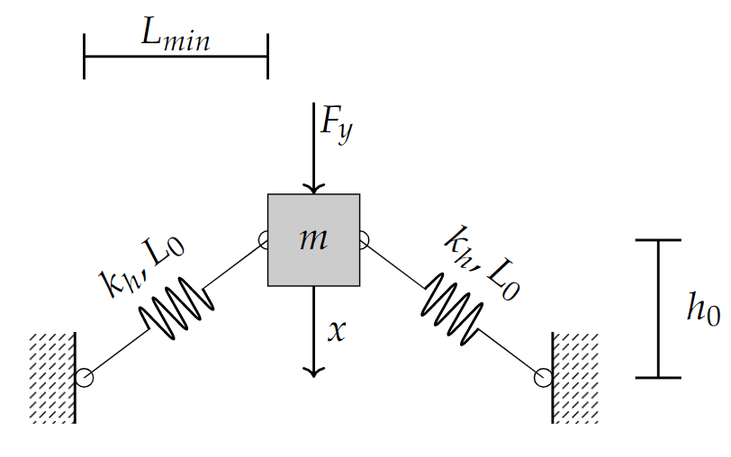

# Introduction

The files in this folder are various stiffness functions for springs. This includes both positive and negative stiffness Springs. In all cases, they employ various input parameters (including the displacement parameter x) and output the force exerted by the spring

## BuckleBeam.m
The function for this code was obtained from [[1]](#1). The resultant force is the force in the vertical direction

### Function: 
* F = BuckleBeam(x, P_e, a, L, q_0)

### Parameters:

| Parameter     | Explanation | Units
| ------------- | :-------------: |:-------------: |
| x             |Displacement| Meter |
| P_e           |Pe = EI( &pi; /L)2  - Classic Euler critical load for hinge-hinged boundary| Newtons|
|a              |Horizontal distance between mass and reference (see diagram)|Meter |
|L              |Full Length of the beam| Meter|
|q_0            |Initial imperfection at the center of the beam| Meter|

Image obtained from [[1]](#1).

### Output:
| Parameter     | Explanation | Units
| ------------- | :-------------: |:-------------: |
| F             |Force| Newtons |

## F_horzSpring_y.m
The function for this code uses horizontal springs for the negative stiffness element. The resultant force is the force in the vertical direction

### Function: 
* F_y = F_horzSpring_y(x, K_h, L_0, L_min, h_0)

### Parameters:

| Parameter     | Explanation | Units
| ------------- | :-------------:                                       |:-------------:|
| x             |Displacement                                           | Meter|
| K_h           |Horizontal Spring Stiffness (spring providing the negative stiffness in the vertical direction)| Newtons/Meter|
|L_0            |Full Length of the springs under no-load               |Meter|
|L_min          |Minimum Length of the springs (springs horizontal)     |Meter|
|h_0            |Height of the horizontal springs under no-load         |Meter|

### Output:
| Parameter     | Explanation | Units
| ------------- | :-------------: |:-------------: |
| F_y             |Force| Newtons |

## F_vertSpring_y.m
Linear approximation of springs with the resultant force acting along the axial direction (Positive stiffness). An offset can be provided to the displacement x 

### Function 
F_y = F_vertSpring_y(x, K_v, preload_dist)

### Parameters:

| Parameter     | Explanation | Units
| ------------- | :-------------:       |:-------------: |
| x             |Displacement           |Meter|
| K_v           |Spring Stiffness       |Newtons/meter|
|h_0            |Desired spring offset  |Meter|
|preload_dist   |Initial preload on the vertical spring when x=0        |Meter|

### Output:
| Parameter     | Explanation | Units
| ------------- | :-------------: |:-------------: |
| F_y             |Force| Newtons |

## References

<a id="1">[1]</a> 
 Xingtian Liu, Xiuchang Huang, Hongxing Hua,
On the characteristics of a quasi-zero stiffness isolator using Euler buckled beam as negative stiffness corrector,
Journal of Sound and Vibration,
Volume 332, Issue 14,
2013,
Pages 3359-3376,
ISSN 0022-460X,
https://doi.org/10.1016/j.jsv.2012.10.037.
(https://www.sciencedirect.com/science/article/pii/S0022460X13000813)
